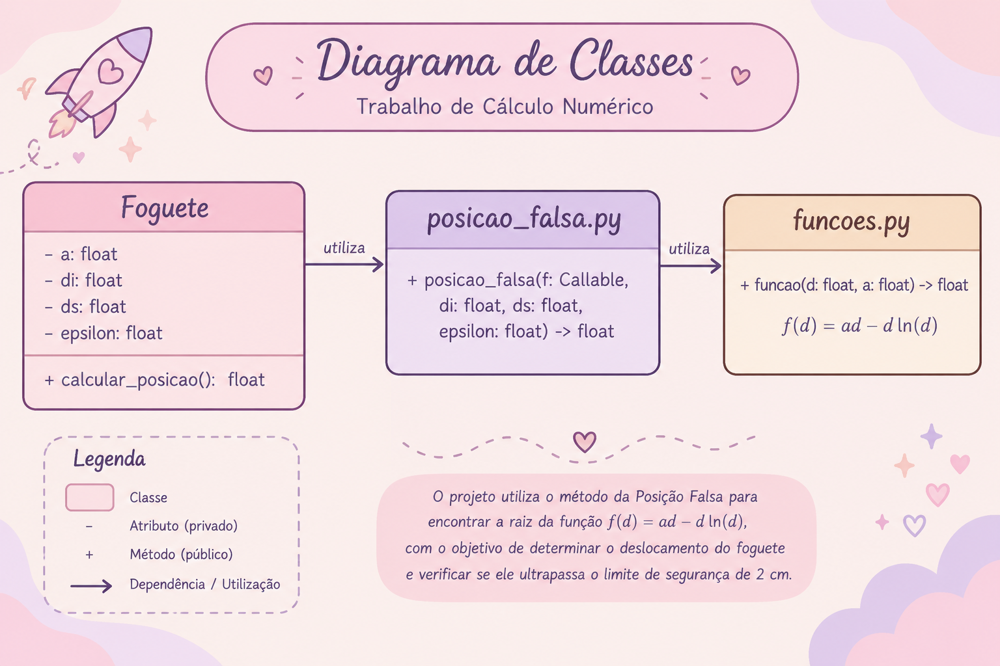

# Trabalho de Cálculo Numérico

Projeto desenvolvido para a disciplina de Cálculo Numérico.

## Tema 1

Análise numérica do deslocamento da extremidade de um foguete espacial durante a reentrada na atmosfera terrestre utilizando dois métodos para encontrar raízes de equações:

- Posição Falsa
- Newton-Raphson

### Função Utilizada

O problema é modelado pela equação:

$$f(d) = a \cdot d - d \cdot \ln(d)$$

Onde:
- `d` é o deslocamento da extremidade do foguete (em centímetros);
- `a` é um parâmetro de ajuste do projeto.

O objetivo do programa é determinar a raiz não nula $f(d) = 0$ para calcular o deslocamento `d` e verificar a condição de segurança ($d \le 2\text{ cm}$).

---

## Métodos Implementados

### 1. Método da Posição Falsa
Método intervalar que utiliza um intervalo inicial $[d_i, d_s]$ contendo a mudança de sinal da função para encurralar a raiz a cada iteração.

### 2. Método de Newton-Raphson
Método aberto de convergência rápida que utiliza a função $f(d)$ e sua derivada $f'(d) = a - \ln(d) - 1$. A partir do intervalo de isolamento $[d_i, d_s]$, o algoritmo adota a estimativa inicial $d_0$ como o ponto médio do intervalo.

---

## Análise de Segurança

Ao resolver $a \cdot d - d \cdot \ln(d) = 0$, obtemos que a raiz exata é dada por $d = e^a$. 

Para garantir a segurança do foguete ($d \le 2\text{ cm}$):

$$e^a \le 2 \implies a \le \ln(2) \approx 0.693147$$

- **$a \le \ln(2)$:** O foguete **NÃO EXPLODE** (deslocamento dentro do limite).
- **$a > \ln(2)$:** O foguete **EXPLODE** (deslocamento ultrapassa 2 cm).

---

## Estrutura do Projeto

* `main.py` — Execução principal do programa, gerenciamento da interface do terminal e definição da classe `Foguete`.
* `funcoes.py` — Implementação da função matemática $f(d)$ e de sua derivada $f'(d)$.
* `posicao_falsa.py` — Algoritmo numérico do método da Posição Falsa.
* `newton_raphson.py` — Algoritmo numérico do método de Newton-Raphson.

---

## Testes Padrão

Para validação dos dois métodos, foi utilizado o teste de referência do enunciado:

* `a = 1`
* Intervalo de isolamento: `(2, 3)`
* Precisão (`epsilon`): `10^-5`

### Resultados Obtidos

| Método | Estimativa Inicial / Intervalo | Iterações | Deslocamento (`d`) | Status |
| :--- | :--- | :---: | :---: | :---: |
| **Posição Falsa** | $[2.0, 3.0]$ | 5 | `2.718282 cm` | ⚠️ FOGUETE EXPLODE |
| **Newton-Raphson** | $d_0 = 2.5$ | 4 | `2.718282 cm` | ⚠️ FOGUETE EXPLODE |

**Conclusão:** Como $a = 1 > \ln(2)$ e o deslocamento calculado ($2.718282\text{ cm}$) ultrapassa o limite de $2\text{ cm}$, o foguete explode em ambos os métodos.

---

## Diagrama de Classes

